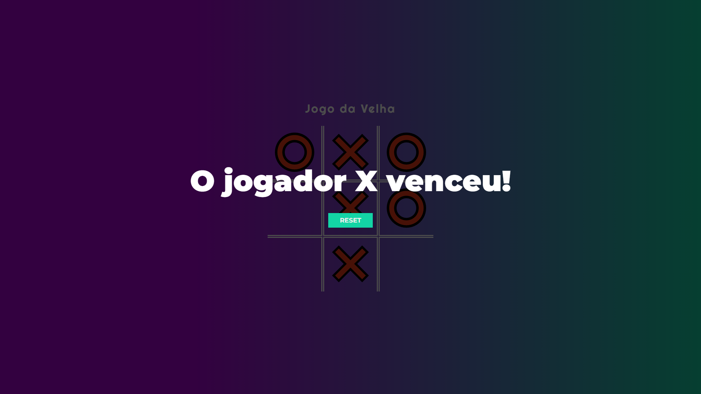

# <b>Jogo da velha</b>

> Um simples jogo da velha feito com no Curso Programador BR, porém com algumas melhorias.

## 💻 Pré-requisitos

Antes de começar, verifique se você atendeu aos seguintes requisitos:

- Windows
  obs: Não sei se roda em Mac ou Linux, nunca usei

## 🤝 Feito por

Agradecemos às seguintes pessoas que contribuíram para este projeto:

<table>
  <tr>
    <td align="center">
      <a href="#">
          <b>Thiago Luiz</b>
        
        
        
      </a>
    </td>
</table>
